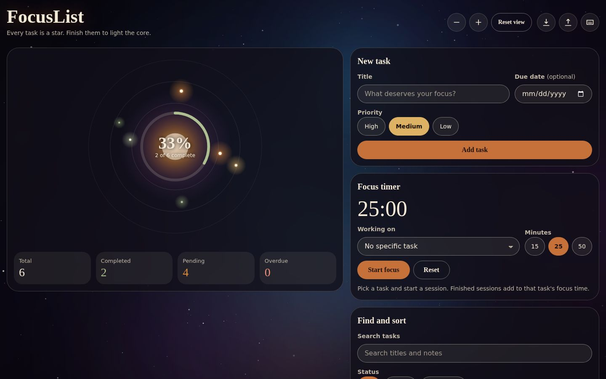
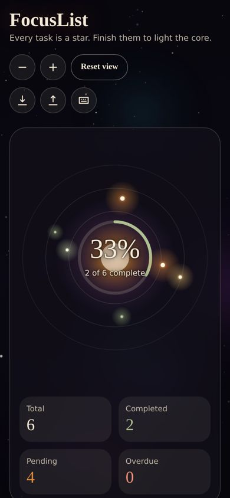

# FocusList

**A task manager where every task is a star.** Add tasks, finish them, and watch the focus core at the centre of your constellation grow brighter.



FocusList is a small, fast, offline-ready web app built with plain HTML, CSS and JavaScript. It has no framework, no build step and no runtime dependencies.

## Why it exists

A flat to-do list tells you what is left but never shows how far you have come. Progress feels invisible, so it is easy to lose momentum. FocusList turns the list into a picture of your workload: each task orbits a core, its size and colour show its priority, and the core fills as you complete tasks. The list next to it stays a fully accessible, keyboard-friendly tool, so the picture adds motivation without getting in the way.

## Features

| Area | What you can do |
| --- | --- |
| Tasks | Add, edit, complete and delete tasks with a title, priority (high, medium, low), optional due date and optional notes |
| Find | Search titles and notes, filter by status and priority, sort by order added, newest, priority or due date |
| Safety | Undo for delete, clear completed and import (7 seconds, or press Ctrl/Cmd+Z). Empty titles are rejected with a clear message |
| Focus timer | 15, 25 or 50 minute sessions tied to a task. Finished sessions add to that task's logged focus time |
| Insight | Live totals, completion percentage, overdue count and a priority distribution chart |
| Constellation | Interactive canvas: hover a star for details, click to select, zoom with the buttons or Ctrl/Cmd + wheel |
| Data | Saved automatically in the browser, kept in sync across tabs, export and import as JSON |
| Offline | Installable as an app (PWA) and works without a connection after the first visit |



## Quick start

You need any static file server. FocusList uses ES modules, so opening `index.html` directly from the file system will not work in most browsers.

```bash
git clone <your-repo-url> focuslist
cd focuslist
npm start            # serves http://localhost:8080 (no install needed)
```

Without Node: `python3 -m http.server 8080` in the project folder works too.

To run the tests and linter:

```bash
npm install          # installs ESLint only
npm test             # 90+ unit and structure tests, no dependencies
npm run lint
```

## Using the app

1. Type a title in **New task**, choose a priority and optionally a due date, then press **Add task**.
2. Tick the circle beside a task to complete it. The core glows brighter and the percentage rises.
3. Click a task title (or a star in the constellation) to select it. The sky zooms to that star and shows a detail card.
4. Use **Find and sort** to narrow the list. The stars for hidden tasks dim so the picture always matches your filters.
5. Choose a task under **Focus timer**, press **Start focus** and work. When the session ends, the time is added to that task.
6. Use the download and upload buttons in the header to back up or restore your list.

### Keyboard shortcuts

| Key | Action |
| --- | --- |
| `N` | Focus the new task field |
| `/` | Focus search |
| `+` / `-` | Zoom the constellation |
| `0` | Reset the view |
| `Ctrl/Cmd` + `Z` | Undo the last delete, clear or import |
| `Esc` | Close a dialog or the task detail |
| `?` | Show the shortcut list |

Shortcuts pause while you type in a field and never override browser shortcuts.

## Project structure

```text
All files sit in one flat folder, so the project uploads to GitHub in one go.
Related files share a prefix instead of a folder.

index.html               Semantic page shell and templates
manifest.webmanifest     PWA metadata
sw.js                    Service worker (offline cache)
serve.js                 Zero-dependency local server (npm start)
tokens.css               Design tokens: colours, type, spacing, motion
base.css                 Reset, element defaults, utilities
layout.css               Page grid and breakpoints
components.css           Buttons, forms, cards, dialog, toast, task list
main.js                  Entry point: creates the store and wires modules together
config.js                Constants and limits
store.js                 State container, actions, undo
taskModel.js             Pure task creation, validation, statistics
filters.js               Pure search, filter and sort
storage.js               Persistence, migration, import and export
timer.js                 Pure focus-timer state machine
utils.js                 Small shared helpers
cosmos-*.js              Canvas visuals: starfield.js background, constellation.js task stars
ui-*.js                  One module per interface area (forms, task list, timer, ...)
*.test.js                node:test suites (logic, storage, contrast, structure)
ARCHITECTURE.md, ACCESSIBILITY.md, PERFORMANCE.md   Design notes
icon-*.png, favicon.svg  App icons
screenshot-*.jpg         README images
```

Read [ARCHITECTURE.md](ARCHITECTURE.md) for how data flows through the app.

## How it is built

- **No framework, no build.** The interface is small enough that native elements and a 60-line store do the job. That keeps the download under 100 KB and removes a whole class of tooling problems.
- **Pure logic is separate from the DOM.** `taskModel`, `filters`, `storage`, `store` and `timer` never touch the page, so they run under Node and are covered by tests.
- **Native controls first.** Radio groups, `<dialog>`, `<select>`, checkboxes and `<input type="date">` give keyboard and screen reader support for free.
- **Tokens for every style value.** Component CSS contains no hard-coded colours; a test enforces it.
- **Safe by construction.** All user text is written with `textContent`, never `innerHTML`, and a strict Content Security Policy blocks inline scripts and third-party origins.

## Data and storage

Tasks live in `localStorage` under `focuslist.tasks.v2`.

```json
{
  "version": 2,
  "tasks": [
    {
      "id": "k1abc23xyz",
      "title": "Draft the Q3 orbit review",
      "priority": "high",
      "done": false,
      "created": 1789800000000,
      "due": "2026-10-01",
      "notes": "",
      "completedAt": null,
      "focusMs": 0
    }
  ]
}
```

- Data from the first version of FocusList (`focuslist_tasks`) is migrated automatically.
- Everything read from storage or an imported file is validated and repaired field by field. Unreadable data is never deleted; a copy is kept under `focuslist.tasks.v2.corrupt`.
- If the browser blocks storage (some private modes), the app keeps working in memory and tells you to export a copy.

## Accessibility

FocusList targets WCAG 2.2 AA. Highlights: skip link, landmarks, one `h1`, visible focus rings, 44 px touch targets, colour never the only signal, screen reader announcements for changes, focus returned after deleting, reduced-motion and forced-colours support. Text contrast is verified by an automated test. Full details are in [ACCESSIBILITY.md](ACCESSIBILITY.md).

## Performance

The app ships about 90 KB of source with no dependencies and no web fonts. Animations adapt to the device, pause when the tab is hidden and stop entirely with reduced motion. Measurements and the reasoning behind each choice are in [PERFORMANCE.md](PERFORMANCE.md).

## Browser support

Current versions of Chrome, Edge, Firefox and Safari (ES modules, `<dialog>`, `ResizeObserver`, CSS custom properties). Older browsers without `<dialog>` are not supported.

## Deployment

FocusList is a static site. Upload the folder to GitHub Pages, Netlify, Cloudflare Pages or any web server. The service worker only registers over HTTPS or on `localhost`.

## Known limitations

- Data is stored per browser. There is no account or cloud sync; use export and import to move between devices.
- Tasks cannot be reordered by dragging. Use the sort menu instead.
- The timer only logs full sessions, so a paused or reset session adds nothing.

## Contributing

See [CONTRIBUTING.md](CONTRIBUTING.md). Changes are listed in [CHANGELOG.md](CHANGELOG.md).

## License

MIT. See [LICENSE](LICENSE).
